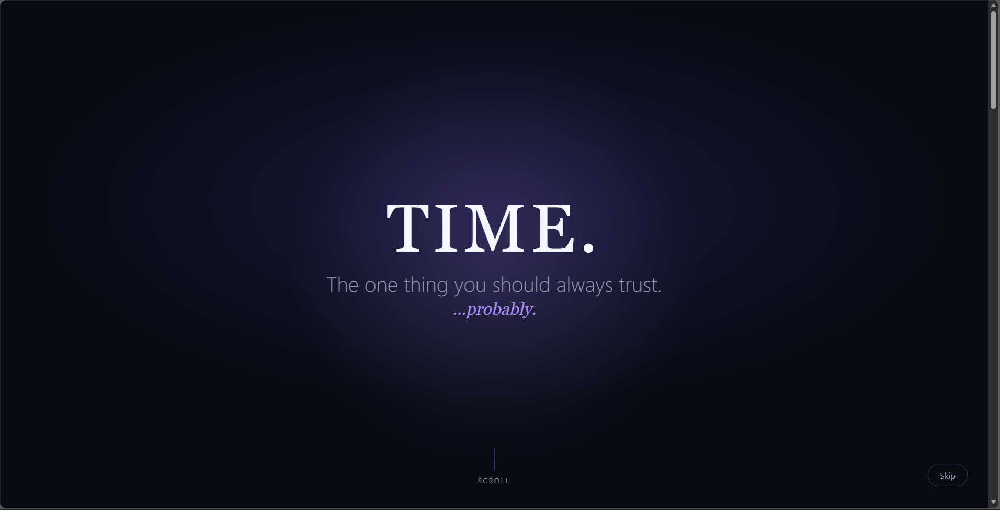
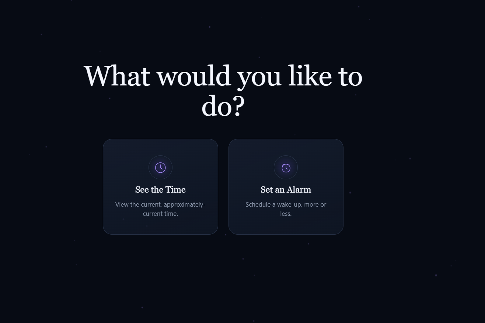
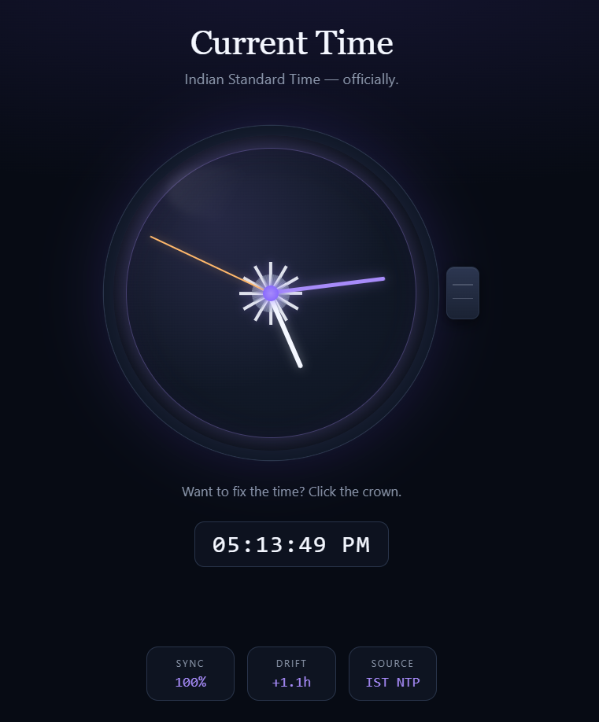
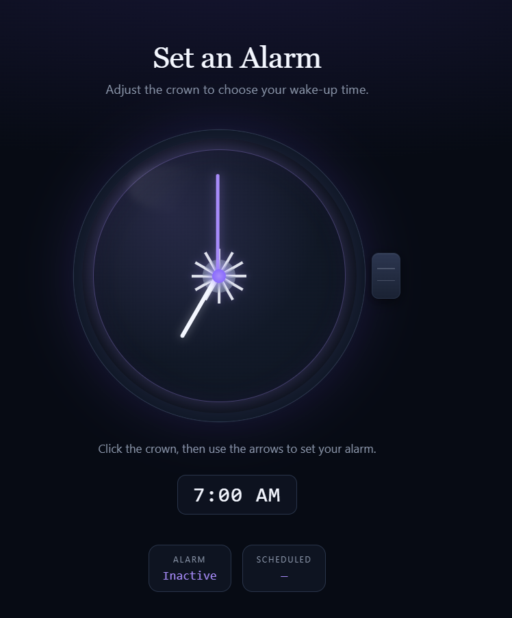

# The Useless Clock 🎯

## Basic Details
### Team Name: [Name]

### Team Members
- Team Lead: Sreyas A - Sree Chitra Thirunal College of Engineering, Thiruvananthapuram

### Project Description
My project is a clock website. It shows us the wrong time. The landing page shows us about Time. As we scroll down, it gives us two options to see the time and set an alarm. 

If we click to see the time, it will leads to another section. There you will see a time which will be wrong. You can adjust the time by clicking the button on the right side of clock just like our watch. Is we proceed with that time, it will set into a random time which is not correct. The loop continues

If user clicks on set an alarm, it will take you to another clock. You can set alarm clock there. But there is another problem. The alarm will set into another time than what you have choosen. This loop also continues.

The time is picked random and mostly impredictable.

### The Problem (that doesn't exist)

I am not solving a real-world problem. I am solving the problem of making something completely useless in the most unnecessarily professional way possible.

### The Solution (that nobody asked for)

I made a clock with incorrect time.

## Technical Details
### Technologies/Components Used
For Software:
- HTML, CSS, and JavaScript
- Chat GPT and Claude

### Implementation
For Software: Designed a functioning website with those features.

### Project Documentation
For Software: Open index.html

# Screenshots (Add at least 3)

This is where the websitw begins scroll as the animations came.

This is the end of scrolling. You will be navigated to Alarm and clock from here

Here you see time. You can adjust time by clicking on the button on the rightside

Here you can set alarm. You can adjust time by the button rightside.

### Project Demo
# Video
<video controls src="Screen Recording 2026-09-13 161813.mp4" title="Title"></video>
Scroll on the website as you get in. You will see two options to see time and set alarm. You can adjust the hour and minute hand by the crown button on rightside of the clock.

Made with ❤️ at TinkerHub Useless Projects 

